# eft_analyzer
Module 7 Challenge


The project is analyzing a fintech ETF that consists of four stocks" GOST, GS, PYPL, and SQ. The data of each stock is saved in the `etf.db` database. The project analyzes the daily returns of the ETF stocks both individually and as a whole. Then deploy the visualizations to a web application by using the `Voila` library. 

---

## Technologies

This project leverages python 3.7 with the following packages:

* [SQLalchemy](https://www.sqlalchemy.org/) 
* [Voila](https://voila.readthedocs.io/en/stable/using.html)
* [hvplot](https://hvplot.holoviz.org/) 


---

## Installation Guide

Before running the application first install the following dependencies.

```
pip install SQLAlchemy
```

```
conda install -c conda-forge voila
```


---

## Usage


To use the ETF analysis simply clone the repository and run the **etf_analyzer.ipynb** with:

```
jupyter lab
```

The Voila web applicaiton results is saved in the `Screenshot` folder. The screenshots include:

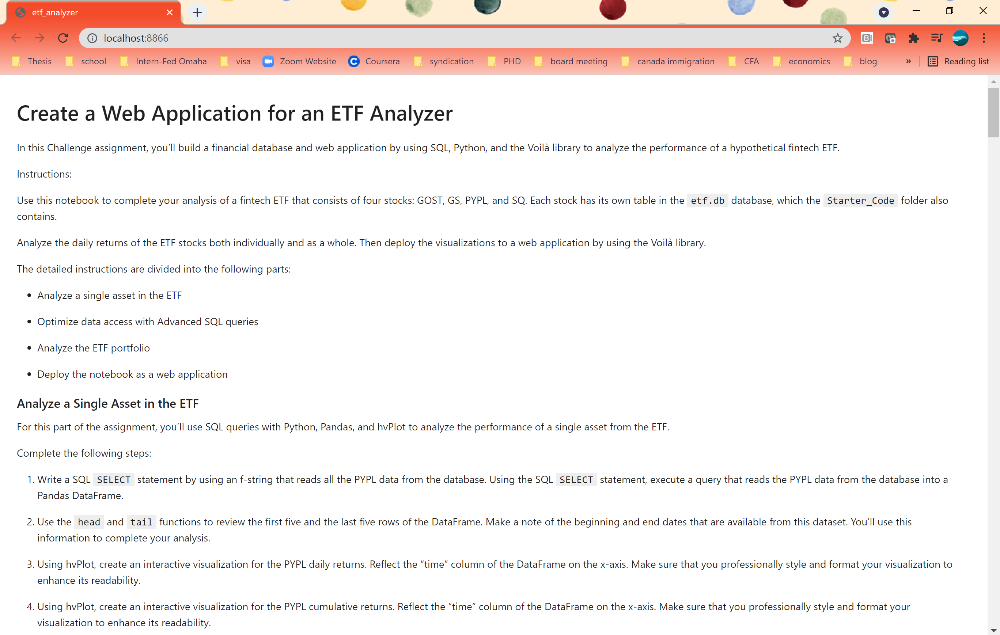


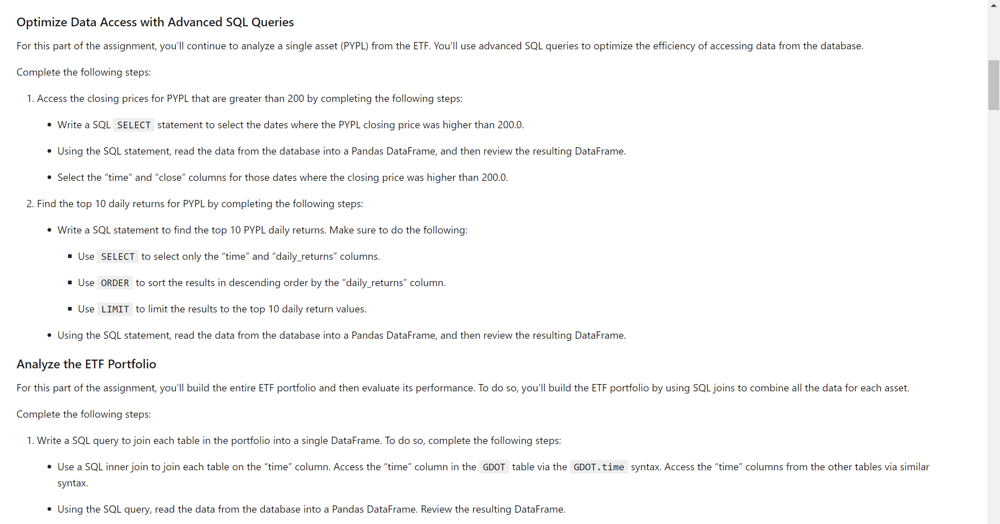


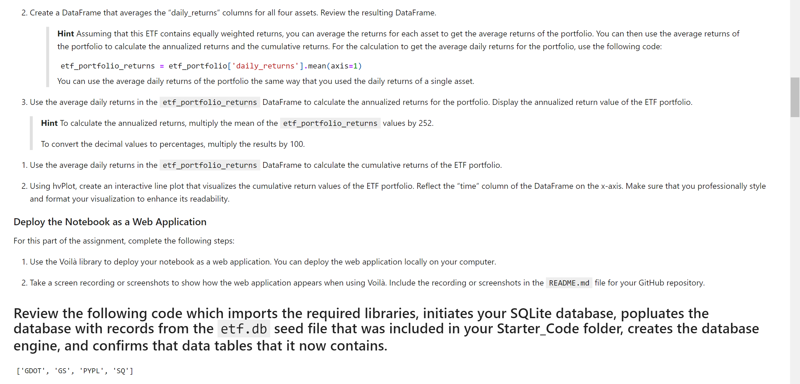


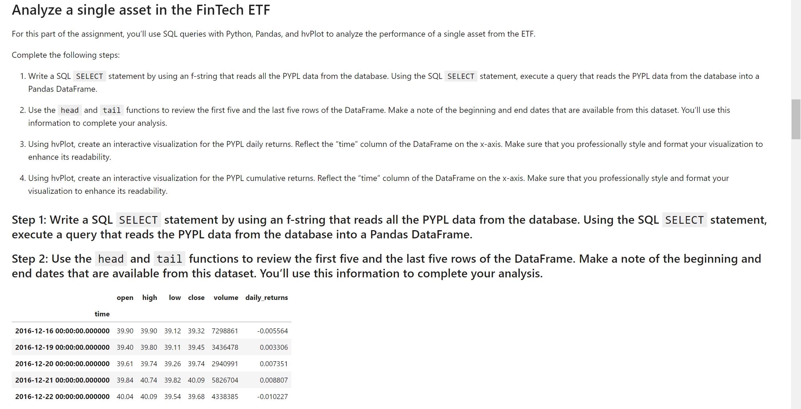


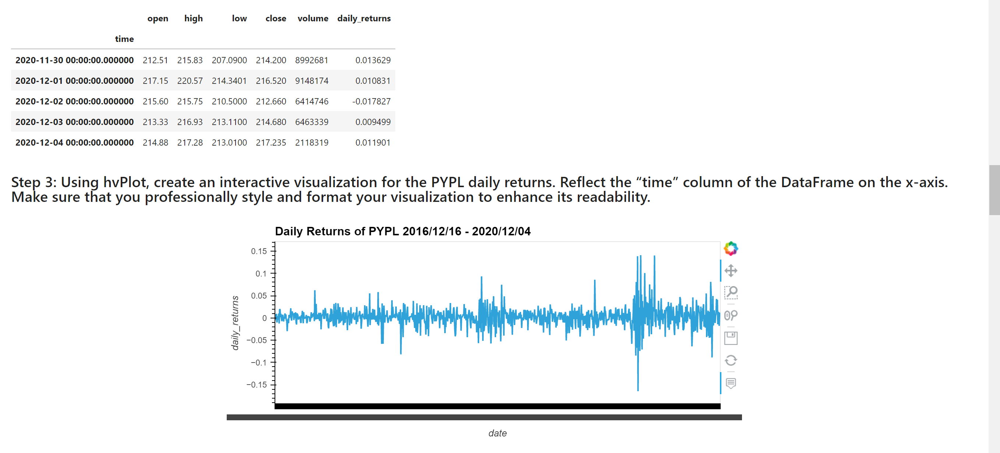


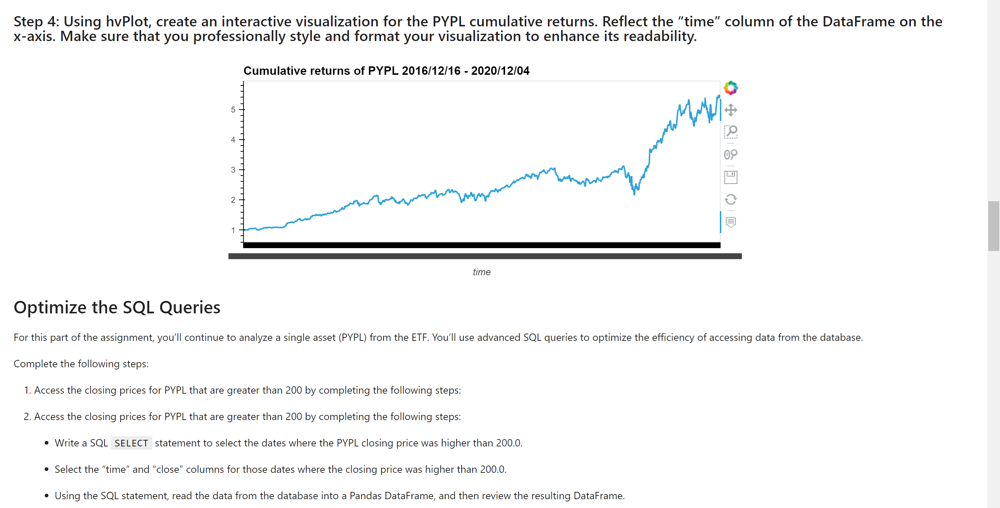


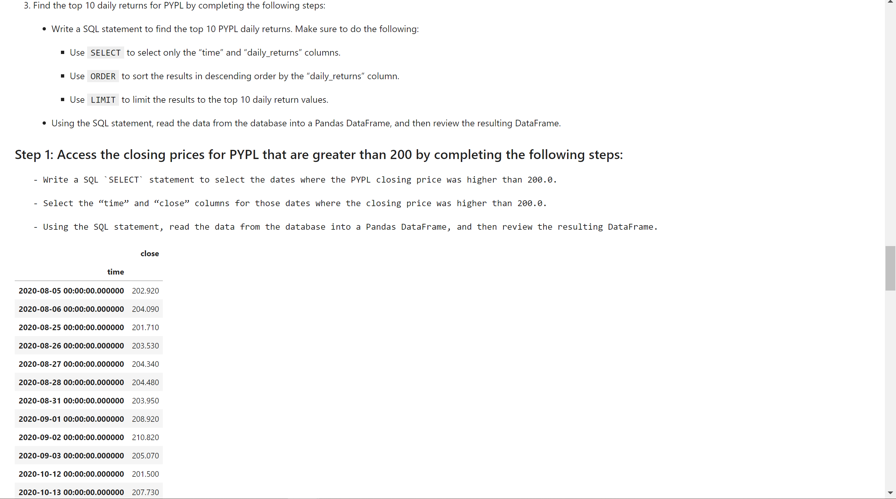


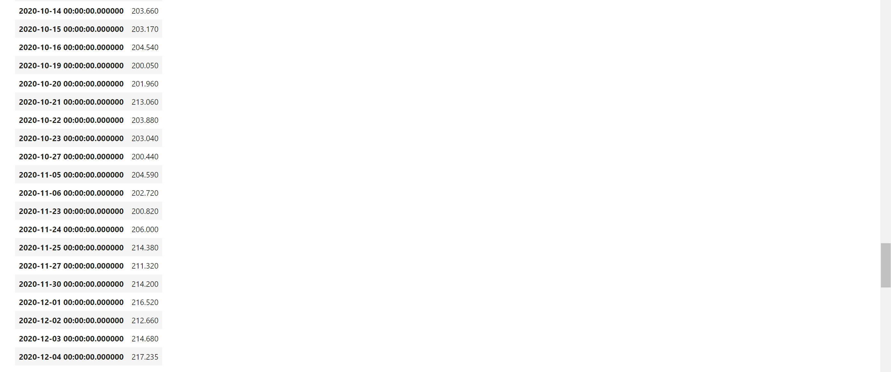


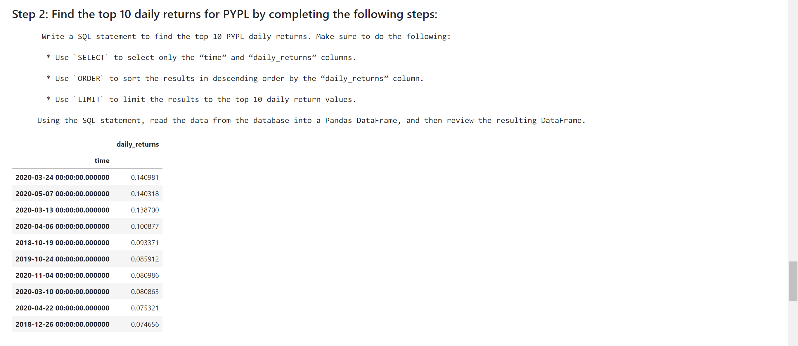


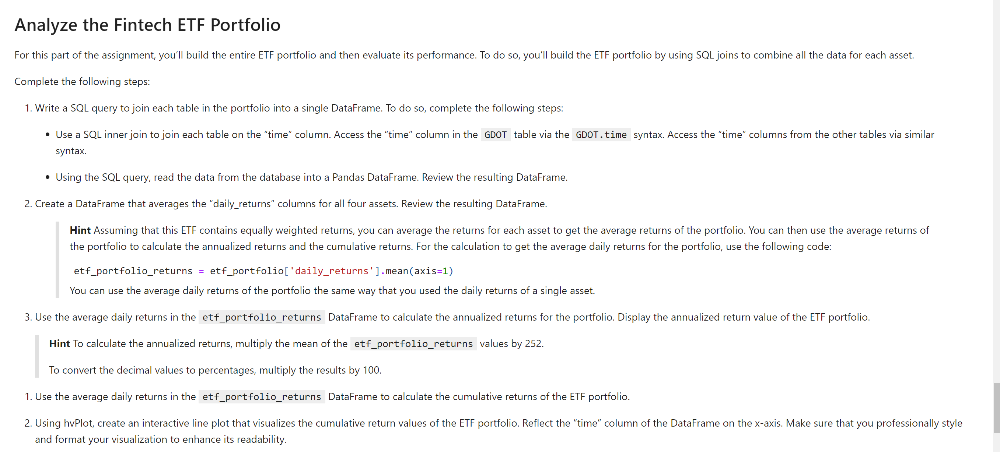


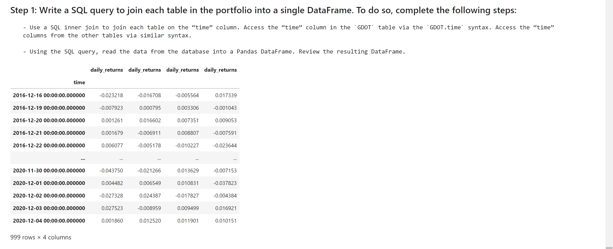


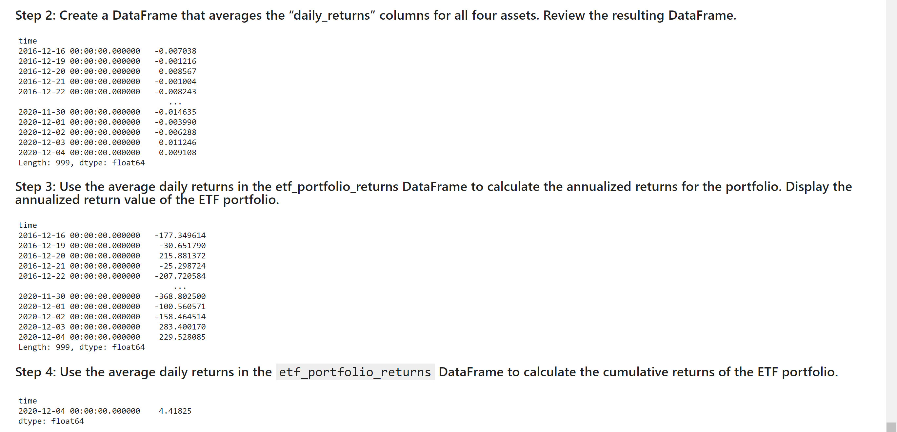


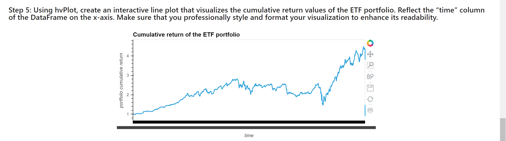

---

## Contributors

Brought to you by SL etf analysis.

---

## License

SL
